<div align="center">

# Vinacou

### Rooms that *sound* as good as they look.

The website for **Vinacou**, a studio that designs and builds acoustic interiors:<br/>
home theatres, recording rooms, workspaces and halls.

<br/>


<br/>

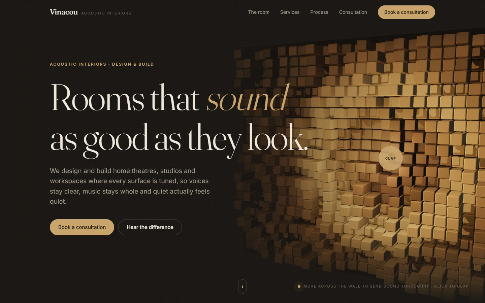

<sub><i>The hero is a live 3D acoustic diffuser. Move across it and sound ripples through the blocks; click and it claps.</i></sub>

<br/><br/>

[**What's inside**](#-whats-inside) · [**Tour**](#-a-quick-tour) · [**On phones**](#-on-phones) · [**Getting started**](#-getting-started) · [**How it works**](#-how-it-works) · [**Project structure**](#-project-structure)

</div>

<br/>

## ✦ What's inside

Most acoustics sites *tell* you a treated room sounds better. This one lets you **see and hear it**.

<table>
  <tr>
    <td width="50%" valign="top">
      <h3>🧱&nbsp; A wall you can play</h3>
      The hero is a real-time 3D <b>skyline diffuser</b>, the kind of wooden block panel studios hang on their walls. Its block depths follow the same quadratic-residue maths used to cut real ones. Your cursor sends sound ripples through it, a click claps, and when you leave it alone it claps on its own.
    </td>
    <td width="50%" valign="top">
      <h3>🎬&nbsp; A room you can treat</h3>
      A 3D media room you can look around. Flip it from <b>Untreated</b> to <b>Treated</b> and watch absorption panels, QRD diffusers, bass traps and a ceiling cloud arrive one by one while the echoes fade away.
    </td>
  </tr>
  <tr>
    <td width="50%" valign="top">
      <h3>🎧&nbsp; A difference you can hear</h3>
      Press <b>Listen</b> for a short loop, a clap and then a plucked chord, played through two synthetic rooms with the Web Audio API. The switch crossfades between them. No audio files, just maths.
    </td>
    <td width="50%" valign="top">
      <h3>🌀&nbsp; Motion with a purpose</h3>
      Headlines tip forward out of their lines, the room opens out as you scroll to it, the process steps slide past in a pinned 3D track, and the service cards tilt towards your cursor. All of it switches off when you ask your device for less motion.
    </td>
  </tr>
</table>

<br/>

## ✦ A quick tour

### 1 · Step inside the room

Every project starts as a model like this one. The same switch drives the 3D treatment, the sound rings on the floor, the reverb readout and the audio demo.

<table>
  <tr>
    <td width="50%">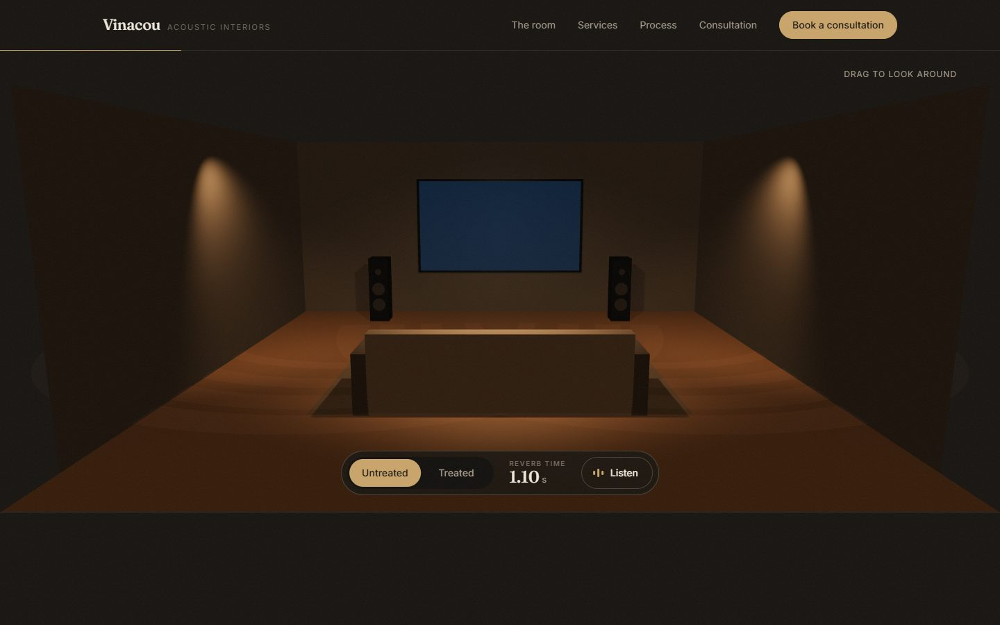</td>
    <td width="50%">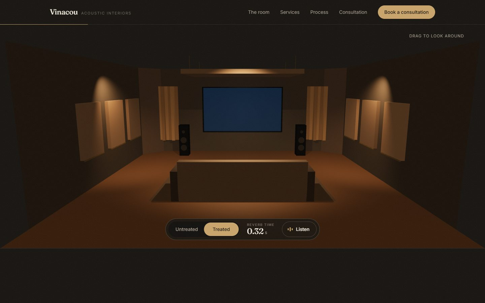</td>
  </tr>
  <tr>
    <td align="center"><b>Untreated</b> · the sound rings keep echoing · <b>1.10 s</b> reverb</td>
    <td align="center"><b>Treated</b> · the panels, diffusers and cloud arrive · <b>0.32 s</b> reverb</td>
  </tr>
</table>

### 2 · Watch the room go quiet

The decay chart plots how fast each room falls silent. Hover (or tap) anywhere on it to read the level at that moment.

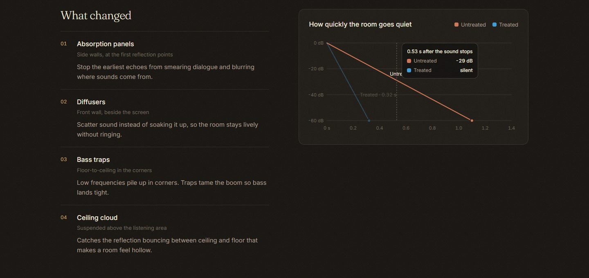

### 3 · Services, process and a conversation

<table>
  <tr>
    <td width="50%">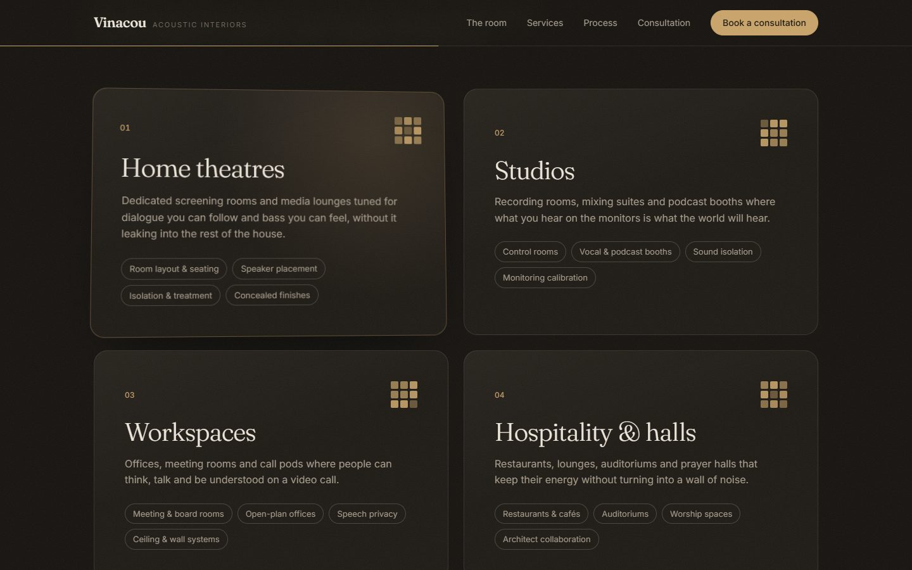</td>
    <td width="50%">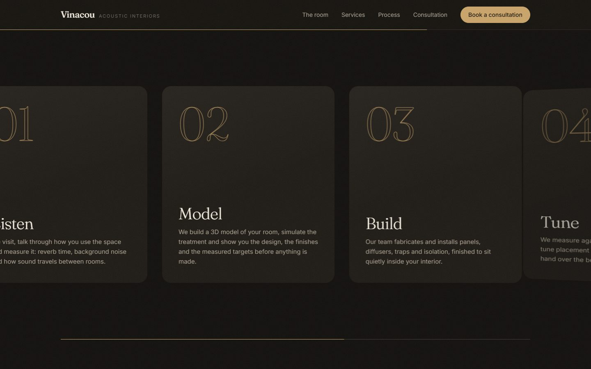</td>
  </tr>
  <tr>
    <td align="center"><b>Services</b> · cards tilt towards the cursor, with layered depth</td>
    <td align="center"><b>Process</b> · a pinned track that slides sideways as you scroll</td>
  </tr>
  <tr>
    <td width="50%">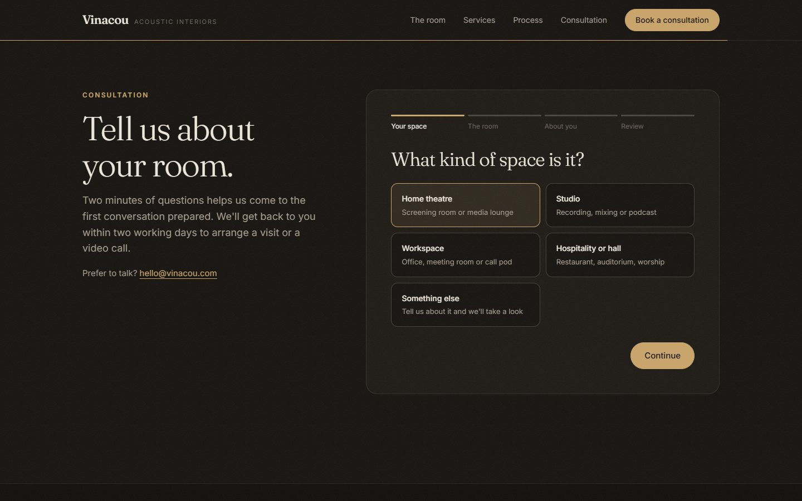</td>
    <td width="50%">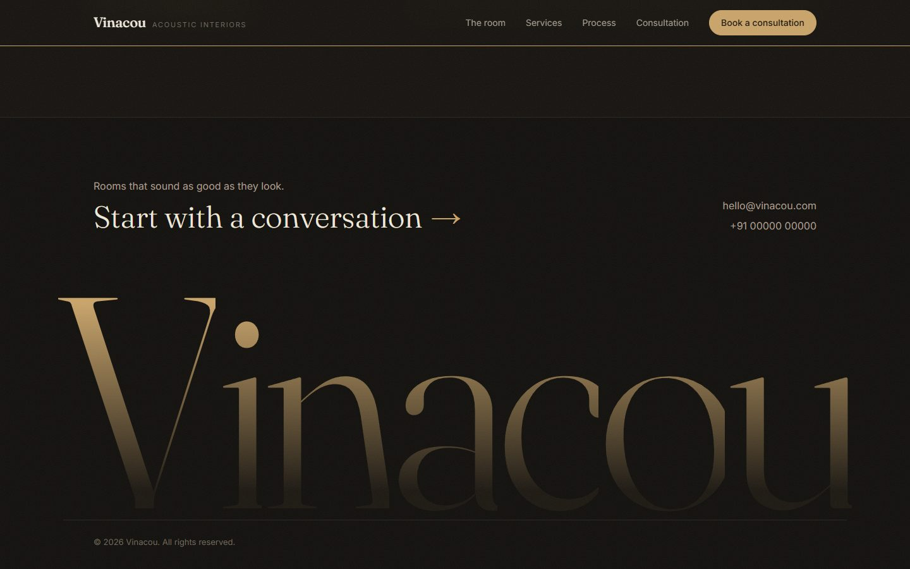</td>
  </tr>
  <tr>
    <td align="center"><b>Consultation</b> · four short steps, then a review</td>
    <td align="center"><b>Footer</b> · the name rises letter by letter</td>
  </tr>
</table>

<br/>

## ✦ On phones

It's designed for touch as well as mouse, not squeezed down from desktop. The wall lies back like a floor under the headline, you tap it to clap, sideways swipes turn the room while vertical swipes still scroll, and the process becomes a timeline that draws itself as you read.

<table>
  <tr>
    <td width="33%">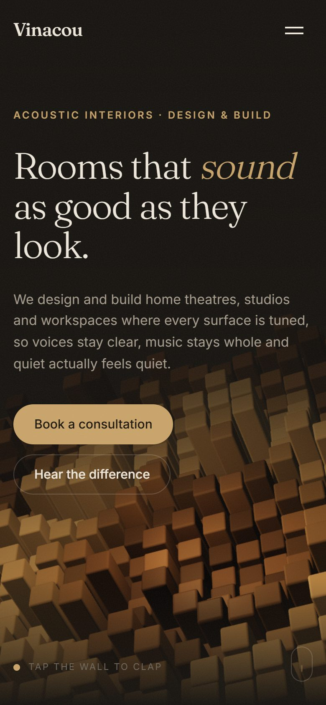</td>
    <td width="33%">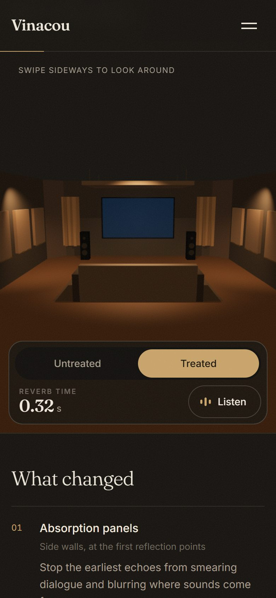</td>
    <td width="33%">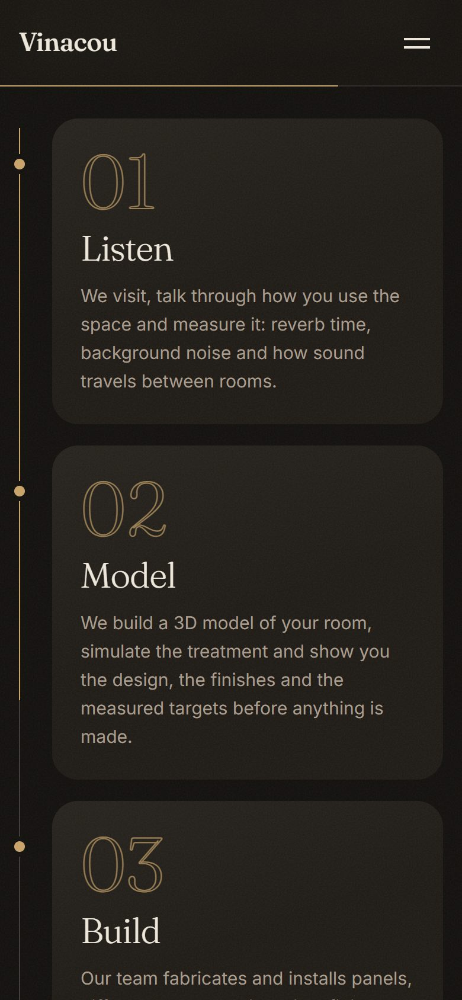</td>
  </tr>
  <tr>
    <td align="center">Tap the wall to clap</td>
    <td align="center">Swipe to look around</td>
    <td align="center">A timeline that draws itself</td>
  </tr>
</table>

<br/>

## ✦ Getting started

You'll need [Node.js](https://nodejs.org/) 20.19+ or 22.12+ (what Vite 8 supports).

```bash
git clone https://github.com/MAD1IZJOD/vinayakoo.git
cd vinayakoo
npm install
npm run dev
```

Then open the address Vite prints (usually <http://localhost:5173>).

| Command             | What it does                        |
| ------------------- | ----------------------------------- |
| `npm run dev`       | Start the local dev server          |
| `npm run build`     | Type-check and build for production |
| `npm run preview`   | Serve the production build locally  |
| `npm run typecheck` | Type-check only                     |
| `npm run lint`      | Lint the codebase                   |

### Configuration

Copy `.env.example` to `.env.local` and fill in the values.

| Variable                | Purpose                                                                                                                                                 |
| ----------------------- | ------------------------------------------------------------------------------------------------------------------------------------------------------- |
| `VITE_CONSULT_ENDPOINT` | A JSON form endpoint (a Formspree URL, for example) that receives consultation requests. If it's unset, the form opens a pre-filled email instead. |

> [!IMPORTANT]
> Never commit real values. `.env.local` is already ignored by git.

> [!NOTE]
> The email address and phone number in `src/lib/site.ts` are placeholders. Swap in the studio's real details before launch.

<br/>

## ✦ How it works

One switch, **Untreated ↔ Treated**, drives everything in the room section, so what you see, read and hear always agree.

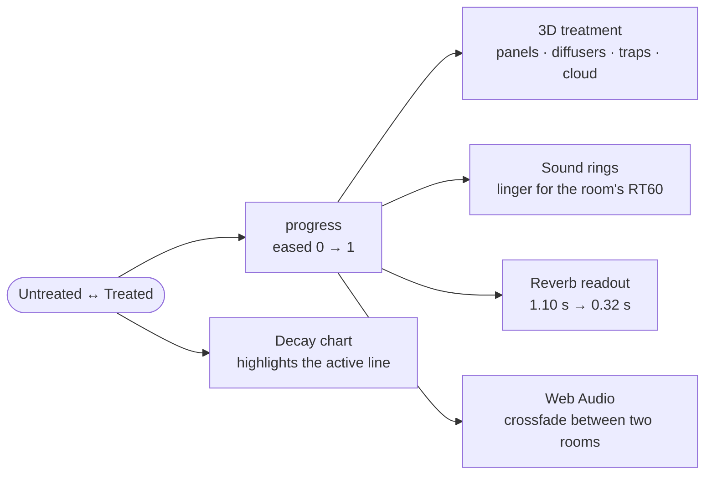

<details>
<summary><b>The diffuser wall</b></summary>

<br/>

- An `InstancedMesh` of rounded wooden blocks: 34 × 22 on desktop, 20 × 26 on phones. That's one draw call for the whole wall.
- Block depths follow `(i² + j²) mod 13`, the 2D quadratic-residue sequence that real skyline diffusers are cut to.
- Every pointer move, click or idle clap adds a *ripple*: a ring that spreads at a fixed speed and dies away quickly, the way a treated room does. Each frame, every block adds up the rings passing through it, lifts forward and warms towards brass at the crest.
- The canvas ignores pointer events, and the hero section forwards them instead, so the page scrolls normally over it on touch screens.
- The wall keeps its own clock. The renderer's clock jumps when the render loop pauses off screen, which would otherwise give ripples a negative age.

</details>

<details>
<summary><b>The acoustics and the audio demo</b></summary>

<br/>

- **RT60** is how long it takes a sound to fall by 60 dB after it stops. The room uses **1.10 s** untreated and **0.32 s** treated, typical values for a media room of about 55 m². These are illustrative figures, not measurements.
- The listening demo builds two impulse responses from exponentially decaying noise, one per RT60. It plays a clap and a plucked A-major arpeggio through both convolvers and does an equal-power crossfade between them as the switch moves.
- The sound rings on the floor use the same RT60, slowed down so the eye can follow them. Reflections fade out as the treatment goes in.

</details>

<details>
<summary><b>Motion</b></summary>

<br/>

- **[GSAP](https://gsap.com/)** with ScrollTrigger and SplitText handles the headline reveals, the pinned process track (with `containerAnimation` for the 3D swing of each card), the room reveal, the marquee and the footer wordmark.
- **[Lenis](https://lenis.darkroom.engineering/)** smooths wheel scrolling and runs on GSAP's ticker, so scroll-linked animations never lag behind the page. Touch devices keep native scrolling.
- Everything that hides content is set up from script, so the page stays readable if JavaScript or animation doesn't run.

</details>

<details>
<summary><b>Performance and accessibility</b></summary>

<br/>

- three.js is code-split into its own chunk and loads after first paint. The room scene loads separately, just before you scroll to it.
- Both 3D scenes stop rendering when they're off screen. Phones get a smaller wall, no shadows and a capped pixel ratio.
- Without WebGL, or if a scene fails, the hero falls back to an animated waveform and the room to a 2D floor plan that shows the same treatment.
- `prefers-reduced-motion` turns off smooth scrolling, pinning, reveals and the wall's ripples. The wall is drawn once and stays still.
- The consultation form moves focus to each step's title, announces errors and is fully keyboard friendly. The decay chart has a data table for screen readers.

</details>

<br/>

## ✦ Project structure

```text
src/
├── sections/      page sections: Hero, RoomSection, Services, Process, Consultation
├── experience/    the 3D scenes
│   ├── DiffuserCanvas.tsx   the interactive hero wall
│   ├── RoomCanvas.tsx       the media room: Room, Treatments, SoundRings, CameraRig
│   └── PlanView.tsx         2D floor-plan fallback
├── components/    Header, Footer, Marquee, Cursor, DecayChart, Waveform, ErrorBoundary
├── hooks/         useScrollMotion, useInView, useTween
├── lib/           content, acoustics model, audio engine, motion setup, consultation logic
└── styles/        global styles and design tokens
docs/images/       the screenshots in this README
```

<br/>

## ✦ Built with

| | |
| --- | --- |
| **UI** | [React 19](https://react.dev/) + [TypeScript](https://www.typescriptlang.org/), built with [Vite](https://vite.dev/) |
| **3D** | [three.js](https://threejs.org/) through [React Three Fiber](https://r3f.docs.pmnd.rs/) and [drei](https://drei.docs.pmnd.rs/) |
| **Motion** | [GSAP](https://gsap.com/) (ScrollTrigger, SplitText) and [Lenis](https://lenis.darkroom.engineering/) |
| **Sound** | The Web Audio API, with synthetic impulse responses and no audio files |
| **Styling** | Plain CSS with design tokens in `src/styles/global.css` |
| **Type** | [Fraunces](https://fonts.google.com/specimen/Fraunces) and [Inter](https://fonts.google.com/specimen/Inter) |

<br/>

<div align="center">
<sub>Designed and built with care, and tuned by ear.</sub>
</div>
